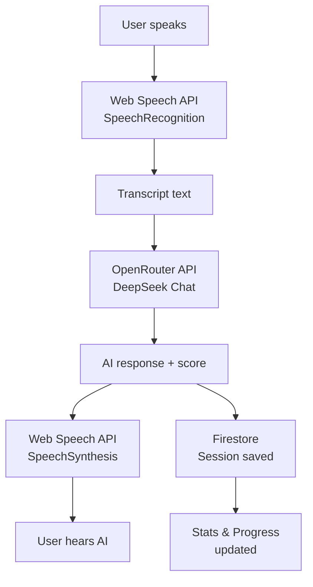

# FluentPM

**Train your voice. Own the room.**


---

## What is FluentPM?

FluentPM is an AI-powered communication training tool for Product Managers. It combines realistic AI conversation practice, gamification, and a spaced-repetition vocabulary system to help PMs — especially non-native English speakers — sharpen their spoken communication before high-stakes interviews and stakeholder meetings.

**The problem:** PM interviews and leadership conversations demand clear, structured, confident speech under pressure. Generic speaking apps don't simulate the specific dynamics of PM work — pushback from stakeholders, behavioral interview formats, or domain-specific language.

**The solution:** FluentPM puts you in realistic PM scenarios with AI opponents that challenge your thinking, score your STAR-format answers, track your vocabulary growth, and adapt to your weaknesses over time.

---

## Features

### Practice Modes
- **Arena** — Real-time debate against an AI opponent. Get scored on clarity, structure, and ownership language across multiple turns.
- **Interview Simulation** — Full PM interview session with an AI interviewer. STAR framework scoring, follow-up probing, and detailed debrief.
- **Lightning Round** — Rapid-fire Q&A to practice spaced-repetition expressions under time pressure.
- **Pushback Drill** — Handle tough stakeholder objections with coached responses.
- **Quick Drill** — 30-second focused answer challenges for busy schedules.
- **Podcast Sim** — Upload a real conversation transcript, pick your role, tag phrases to practice, and perform your side of the conversation with AI scoring.

### Learning System
- **Lexicon** — Personal expression library with automatic AI enrichment (definition, usage examples, pronunciation tips) and spaced-repetition scheduling.
- **Story Bank** — Store and manage your STAR stories for behavioral interview prep.
- **Custom Questions** — Import your own question bank for personalized practice.

### Analytics & Gamification
- **Stats Dashboard** — Session history, difficulty breakdown, scoring trends, and debrief cards.
- **Progress Tracker** — XP, rank progression, streaks, and achievement badges.
- **League** — Weekly rankings to add a competitive edge to daily practice.

---

## Tech Stack

| Category | Technology |
|----------|-----------|
| Frontend | React 19, Vite 8 |
| Language | JavaScript (ES Modules) |
| Styling | Inline CSS-in-JS |
| Database | Firebase Firestore |
| Auth | Firebase Auth (Google Sign-In) |
| AI / LLM | OpenRouter API (DeepSeek Chat) |
| Speech Input | Web Speech API (SpeechRecognition) |
| Speech Output | Web Speech API (SpeechSynthesis) |
| Hosting | Firebase Hosting |

---

## Architecture

```
User (Google Auth)
       │
       ▼
Firebase Auth ◄──────────────────► Firestore
       │                           (sessions, lexicon,
       ▼                            progress, stories)
  App.jsx (React SPA)
       │
       ├─ Speaking input ──► Web Speech API (STT)
       │
       ├─ AI responses ────► OpenRouter (DeepSeek)
       │                     ↳ System prompts with STAR scoring,
       │                       role isolation, feedback blocks
       │
       ├─ TTS playback ────► Web Speech API (SpeechSynthesis)
       │                     ↳ 12 character voice profiles
       │
       └─ Session save ────► Firestore addDoc
```



---

## Getting Started

### Prerequisites

- Node.js 20+
- A Firebase project with **Firestore** and **Google Authentication** enabled
- An [OpenRouter](https://openrouter.ai) API key

### 1. Clone & Install

```bash
git clone https://github.com/ashishworkacc/fluentpm.git
cd fluentpm
npm install
```

### 2. Configure Environment

```bash
cp .env.example .env
```

Open `.env` and fill in your Firebase config values (from Firebase Console → Project Settings → Your apps) and your OpenRouter API key.

### 3. Start the Dev Server

```bash
npm run dev
```

Open `http://localhost:5173` in your browser. Sign in with a Google account to start practicing.

### 4. Build for Production

```bash
npm run build
```

Deploy the `dist/` folder to Firebase Hosting or any static host.

---

## Roadmap

- [ ] **Voice coaching dashboard** — WPM, filler word frequency, and pacing trends across sessions
- [ ] **Podcast Sim history** — Compare past podcast sessions and track phrase mastery over time
- [ ] **Multi-language support** — Practice modes adapted for non-English PM interview markets
- [ ] **AI readiness score** — Weekly assessment that surfaces your weakest question types and suggests a daily drill plan

---

## Contributing

Contributions are welcome. Please read [CONTRIBUTING.md](CONTRIBUTING.md) for setup instructions, coding conventions, and the PR process.

---

## Legal & Ethics

This project is licensed under the **GNU Affero General Public License v3.0 (AGPL-3.0)**. If you run a modified version as a network service, you must make your source code available to users of that service.

This tool is intended for **personal, non-commercial use** — language learning, interview preparation, and self-improvement. Please read [TERMS_OF_USE.md](TERMS_OF_USE.md) for the full ethical use guidelines, including attribution requirements and restrictions on commercial redistribution.

For security vulnerabilities, see [SECURITY.md](SECURITY.md).

---

## Acknowledgments

- [DeepSeek](https://deepseek.com) / [OpenRouter](https://openrouter.ai) — LLM backbone
- [Firebase](https://firebase.google.com) — Auth and real-time database
- [Web Speech API](https://developer.mozilla.org/en-US/docs/Web/API/Web_Speech_API) — Browser-native speech recognition and synthesis
- [Vite](https://vitejs.dev) & [React](https://react.dev) — Build tooling and UI framework
